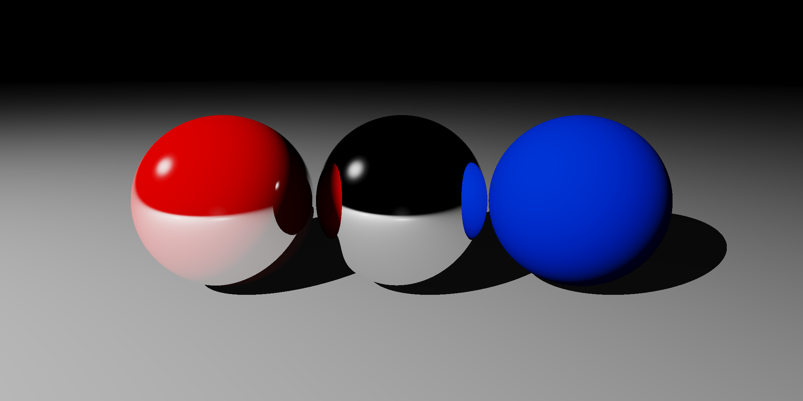
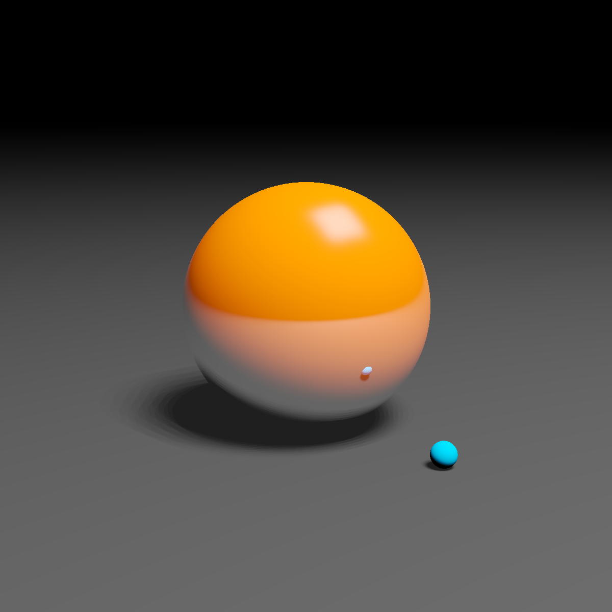

# Python_RayTracer

This is a simple implementation of a Ray Tracer in Python 3.

## Dependencies
* PILLOW
* Pygame

## Instructions
Run __[main.py](main.py)__

Changing the scene can be done by importing the other scene in __line 2__ of __[main.py](main.py)__ from __[Res/Scene_files](Res/Scene_files)__ or by creating on yourself. Changes can be done in respective scene file in __[Res/Scene_files](Res/Scene_files)__.

## ChangeLog

### Sept 23, 2022
* Removed Hybrid-Log Gamma tonemapping curve.
* Now using pygame for ```Vec``` and ```Color``` classes instead of self implemented Python classes, for speed.
### May 31, 2021
* Included Support for Area Lights
* Support for Soft Shadows
* Added Quad as a Composite Object

### May 22, 2021 
* Added Triangle as a Primitive Object
* Added Cube as a Composite Object
* Included Support for High Dynamic Range Rendering using Hybrid-Log Gamma Curve
* Included Support for Region Rendering

### May13, 2021
* Included support for Multi-core Rendering

## Features
### Shading
* Diffuse Shading (Lambert)
* Specular Highlights(Blinn-Phong)
* Specular and Diffused Reflections
* Recursive Reflections with unlimited depth (to recursion limit)
* Soft Shadows
* Stochastic Sampling for Reflections and Shadows

### Architecture
* Multiple Lights
* Multiple Objects
* Spheres
* Planes
* Triangles
* Perspective and Orthographic Camera
* Multi-Threaded Rendering


| Some  | Examples |
| ------------- | ------------- |
|||
|||
|||

## Current Limitations
* No Anti-aliasing (SuperSampling)
* No GUI


Most of the Limitations will be removed in future commits..
I did this as a fun project to increase my knowledge in Python.

</br>
</br>

__Thanks for reading!__ 🙂

*Your contribution will be appreciated.*